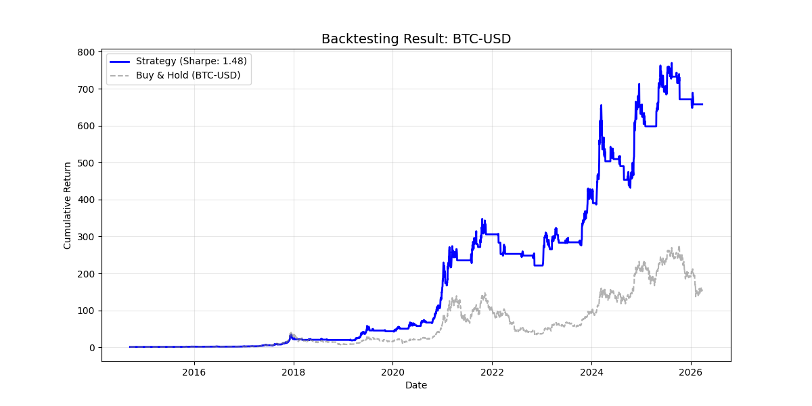

# Crypto Quantitative Backtesting Engine (WFA-based)

This repository contains a professional-grade backtesting engine for cryptocurrency trading, implemented in Python. It features **Walk-Forward Analysis (WFA)** and a **Dual-Stop Risk Management** framework to ensure strategy robustness.
## Key Features
- **Vectorized Engine**: Built with `Pandas` and `NumPy` for high-performance backtesting.
- **Walk-Forward Analysis (WFA)**: Implements rolling window training and out-of-sample testing to mitigate overfitting.
- **Dual-Stop Mechanism**: Combines a fixed **Hard Stop** (-10%) with a dynamic **ATR-based Trailing Stop** to manage volatility risk.
- **Performance Analytics**: Provides comprehensive metrics including **Sharpe Ratio, Sortino Ratio, Max Drawdown, and Win Rate**.
- **Position Sizing**: Integrated **Half-Kelly Criterion** for optimal capital allocation.

## Strategy Logic
- **Signal**: Moving Average Crossover (Short/Long) filtered by a dynamic RSI threshold.
- **Risk Control**: Dynamic ATR stop is used to lock in profits and limit downside in high-volatility markets (common in BTC/ETH).

## 📊 Strategy Performance
The strategy combines Moving Average Crossover with RSI filtering and ATR-based dynamic stops.

*(Note: Blue line represents the strategy; Gray dashed line is Buy & Hold benchmark)*

## Installation & Usage
1. Clone the repository:
   git clone https://github.com

